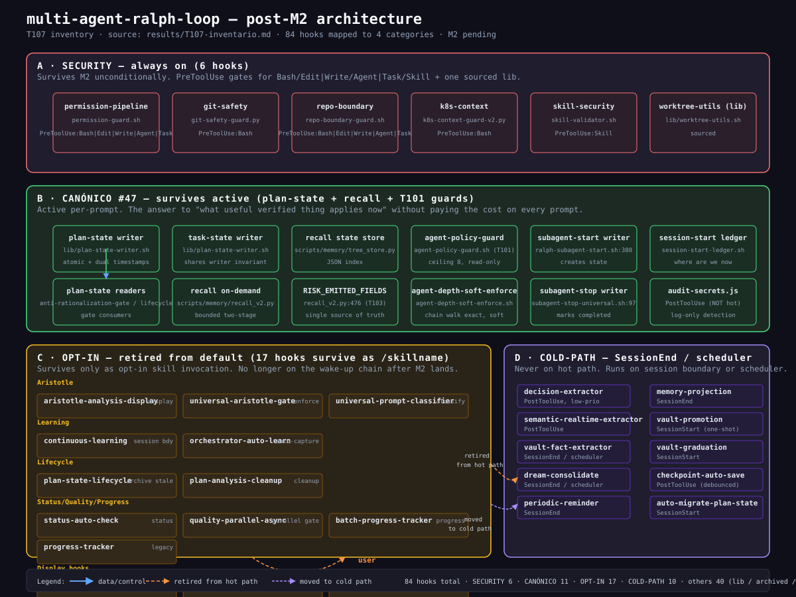

# Multi-Agent Ralph Loop

Autonomous orchestration framework for Claude Code with MemPalace-inspired memory, Agent Teams, and quality gates.

## What It Does

Ralph extends Claude Code into a multi-agent development framework with a structured memory system inspired by the [Memory Palace technique](https://en.wikipedia.org/wiki/Method_of_loci). Every task is analyzed from first principles, decomposed into focused subtasks, assigned to specialized teammates, and validated through quality gates before completion.

| Capability | Description |
|---|---|
| **MemPalace Memory** | 4-layer memory stack (L0-L3) with Obsidian vault knowledge graph and learned rules taxonomy |
| **6 Teammates** | ralph-coder, ralph-reviewer, ralph-tester, ralph-researcher, ralph-frontend, ralph-security |
| **Hook System** | Lifecycle hooks for validation, quality gates, security guards, and automatic learning |
| **Aristotle (opt-in skill)** | 5-phase deconstruction via /aristotle for ambiguous/high-impact work — retired from the default chain by #69 Phase 3 |
| **Quality Gates** | 4-stage blocking validation: correctness, quality, security, consistency |
| **Comprehensive Tests** | Full test suite covering layers, hooks, security, skills, and pipeline |

## MemPalace Memory System

Inspired by the [MemPalace repository](https://github.com/tcsenpai/mempalace) (Memory Palace technique for LLM agents), Ralph implements a layered memory architecture with key differences based on our implementation findings.

### Layer Stack (Session Wake-up)

| Layer | File | Purpose |
|-------|------|---------|
| L0 | `~/.ralph/layers/L0_identity.md` | Agent identity + principles |
| L1 | `~/.ralph/layers/L1_essential.md` | Actionable rules (filtered from corpus) |
| L2 | `.claude/rules/learned/{halls,rooms,wings}/` | Project-specific taxonomy (on-demand) |
| L3 | Obsidian vault grep | Full knowledge base queries (on-demand) |

### Learned Rules Taxonomy

Rules organized in 3 dimensions for flexible retrieval:

| Dimension | Directory | Organization |
|-----------|-----------|--------------|
| **Halls** (by type) | `.claude/rules/learned/halls/` | decisions, patterns, anti-patterns, fixes |
| **Rooms** (by topic) | `.claude/rules/learned/rooms/` | hooks, memory, agents, security, testing |
| **Wings** (by scope) | `.claude/rules/learned/wings/` | `_global/`, `multi-agent-ralph-loop/` |

### Key Implementation Findings

These findings emerged during our MemPalace implementation and may be relevant to others building LLM memory systems:

| Finding | Detail |
|---------|--------|
| **Encoding doesn't reduce tokens** | Unicode PUA encoding increased BPE tokens. Word count metrics falsely reported reduction. |
| **Selection beats encoding** | Choosing fewer rules achieved the target; compressing the same rules did not. |
| **Taxonomy needs noise filtering** | 46% of auto-learned rules were noise (cross-domain repeats, vague bundles). Filtering is essential. |

Full analysis: [AAAK_LIMITATIONS_ADR](docs/architecture/AAAK_LIMITATIONS_ADR_2026-04-07.md)

### Learning Pipeline (Automatic)

```
SESSION (any repo)
  |
  +-- Stop      --> (automatic learning removed by #69 Slice D; writes are explicit)
  +-- PostToolUse --> semantic extractors  --> vault facts & decisions
  +-- SessionStart --> (automatic graduation removed by #69 Slice D)
  +-- SessionEnd   --> (automatic indexing removed by #69 Slice D)
```

All learning flows project -> global -> vault. Only universal patterns graduate to global scope.

## Quick Start

```bash
git clone https://github.com/alfredolopez80/multi-agent-ralph-loop.git
cd multi-agent-ralph-loop

# Validate global infrastructure
bash scripts/validate-global-infrastructure.sh

# Run tests
python3 -m pytest tests/ -q

# Use
/orchestrator "Create a REST API endpoint"
/iterate "Fix all lint errors"
/security src/
```

## Agent Teams

6 specialized teammates for parallel execution:

| Teammate | Role | Tools |
|---|---|---|
| `ralph-coder` | Implementation | Read, Edit, Write, Bash |
| `ralph-reviewer` | Code review (OWASP) | Read, Grep, Glob |
| `ralph-tester` | Testing | Read, Edit, Write, Bash(test) |
| `ralph-researcher` | Research (web search) | Read, Grep, Glob, WebSearch |
| `ralph-frontend` | Frontend (WCAG 2.1 AA) | LSP, Read, Edit, Write, Bash |
| `ralph-security` | Security (6 pillars) | LSP, Read, Grep, Glob, Bash |

Agent Teams is enabled via `CLAUDE_CODE_EXPERIMENTAL_AGENT_TEAMS=1` in settings.json. Teammates can be spawned by the orchestrator, iterate, parallel, security, and task-batch skills when a task benefits from it.

## Core Skills

| Skill | Purpose |
|---|---|
| `/orchestrator` | Full 10-step workflow: evaluate, clarify, classify, plan, execute, validate, retrospect |
| `/iterate` | Iterative execution until VERIFIED_DONE |
| `/parallel` | Run multiple independent tasks concurrently |
| `/task-batch` | Autonomous batch execution from PRD files |
| `/gates` | Multi-language quality gate validation |
| `/security` | Multi-agent security audit (OWASP, semgrep, gitleaks) |
| `/autoresearch` | Autonomous experimentation loop with Smart Setup |
| `/adversarial` | Spec refinement with multi-model cross-validation |
| `/bugs` | Systematic bug hunting |
| `/ship` | Pre-launch checklist (gates + security + review) |
| `/spec` | Verifiable technical specification before coding |

## Quality Gates

4-stage validation, all blocking except consistency:

1. **CORRECTNESS** -- Syntax valid, logic sound
2. **QUALITY** -- Types, no debug artifacts
3. **SECURITY** -- semgrep + gitleaks + OWASP validation
4. **CONSISTENCY** -- Linting and style (advisory)

Hook enforcement via `TeammateIdle` and `TaskCompleted` events ensures no agent completes without passing gates.

## Architecture (post-M2)

The repo has 84 hooks in `.claude/hooks/`. After the M2 retirement (T106),
they fall into four categories by **default registration**, not by file
existence: always-on security, active canonical #47, retired-to-opt-in
hooks, and cold-path session/scheduler hooks.



Source of truth: [`results/T107-inventario.md`](results/T107-inventario.md). Every row in the inventory traces to a real file in the repo; if a source link breaks, delete the row.

### Categories at a glance

| Category | Default registration | Shape | Why it survives (or gets retired) |
|---|---|---|---|
| **SECURITY** (always on) | 6 hooks on `PreToolUse` + 1 sourced lib | permission-pipeline, git-safety, repo-boundary, k8s-context, skill-security, worktree-utils | Survives M2 unconditionally. The failure open / fail-closed contract is verified end-to-end in `tests/security/SECURITY_BASELINE.json` and reproduced by the regression fixtures. |
| **CANÓNICO #47** (active) | Plan-state writer + readers, recall on-demand, task-state, T101 guards, subagent state writers | The answer to "what useful verified thing did we learn, where is it, and how do I get it without paying the cost on every prompt". Bounded retrieval, atomic writes, exact chain walk for depth. | Survives active because the canonical answer to #47 is "demand-driven recall on a bounded corpus", not "load the whole vault every turn". |
| **OPT-IN** (retired from default) | 17 hooks survive only as `/skillname` opt-in (aristotle, learning, lifecycle, status, quality-parallel, progress, display, extract-moved) | Removed from `~/.claude/settings.json` default chain by M2. User invokes via `/aristotle`, `/format`, `/audit`, etc. | Retired because the per-prompt overhead was never paired with evidence of material benefit for the default case. The hook survives on disk for explicit invocation. |
| **COLD-PATH** (session/scheduler) | extractors, dream, consolidation, vault migration, checkpoint | Runs on `SessionStart` (one-shot) / `SessionEnd` / `PostToolUse` (debounced) — never on per-prompt events. | Stays because compaction, consolidation, and state migration are inherently async work; the cost should never appear on the per-prompt hot path. |

### Why this matters

The pre-M2 default SessionStart/PreToolUse wake-up chain registered ~50 hooks; after M2 it registers ~12 (the 6 SECURITY + ~5 CANÓNICO + the session lifecycle minimum). The remaining ~70 hooks become opt-in (user-invoked) or cold-path (session-end). The per-prompt cost drops from "every hook fires" to "the 12 that matter fire". The architectural lesson is the one T107 leaves in the commit history: **the correct architecture usually removes things rather than adds them**.

## Security

The framework includes multiple layers of security enforcement:

| Layer | Trigger | Purpose |
|---|---|---|
| `git-safety-guard.py` | PreToolUse (Bash) | Blocks destructive git operations and command chaining |
| `repo-boundary-guard.sh` | PreToolUse (Bash) | Prevents operations outside current repo |
| `audit-secrets.js` | PostToolUse | Audit logging for 20+ secret patterns |
| `task-completed-quality-gate.sh` | TaskCompleted | Multi-gate validation before task completion |
| `task-plan-sync.sh` | TaskCreated | Syncs task creation to plan-state.json |

## Context Optimization

Ralph uses symlinks (not copies) for all global rules, skills, and agents. This eliminates content duplication and reduces context overhead by ~29% (~10K tokens saved per session).

```bash
# Sync rules from repo to global (creates symlinks)
bash scripts/sync-rules.sh

# Preview changes without executing
bash scripts/sync-rules.sh --dry-run
```

Distribution policy: See `docs/architecture/DISTRIBUTION_POLICY.md` for the symlink vs copy strategy per component type (Rules=COPY, Hooks=COPY, Agents=SYMLINK, Skills=MIXED).

## Requirements

| Tool | Version | Required |
|---|---|---|
| Claude Code | v2.1.42+ | Yes |
| Bash | 4.0+ | Yes |
| jq | 1.6+ | Yes |
| git | 2.0+ | Yes |
| python3 | 3.8+ | Yes (for tests) |
| Obsidian | Any | Optional (for vault KG) |
| GitHub CLI | Any | Optional |
| semgrep | Any | Optional (security) |
| gitleaks | Any | Optional (secrets) |

## Testing

```bash
python3 -m pytest tests/ -q                    # Full test suite
bash scripts/validate-global-infrastructure.sh  # Infrastructure checks
```

## Configuration

The system is **model-agnostic** -- all skills and agents inherit the configured model from settings, no per-command flags required.

```json
{
  "env": {
    "ANTHROPIC_DEFAULT_SONNET_MODEL": "your-model",
    "CLAUDE_CODE_EXPERIMENTAL_AGENT_TEAMS": "1"
  }
}
```

Skills are symlinked to multiple platform directories. Source of truth: `.claude/skills/` in this repo.

## Global Infrastructure

All Ralph advantages (Plan Mode, Agent Teams) work in **any project** -- rules, skills, and agents are symlinked globally.

```bash
# Validate global infrastructure
bash scripts/validate-global-infrastructure.sh

# Auto-fix broken symlinks
bash scripts/validate-global-infrastructure.sh --fix
```

## Autoresearch

Autonomous experimentation loop inspired by [karpathy/autoresearch](https://github.com/karpathy/autoresearch). Continuously modifies code, measures metrics, and keeps only improvements.

**Smart Setup** reduces configuration from 14+ manual parameters to 2-3 guided questions:

| Phase | Name | What it does |
|---|---|---|
| 0 | **SCOUT** | Silent auto-detection of project type, scripts, metrics |
| 1 | **WIZARD** | 2-3 AskUserQuestion with pre-filled options and previews |
| 2 | **VALIDATE** | Dry-run verification (eval works, metric extracts, git clean) |

9 domain templates: ML Training, Node.js Tests, Bundle Size, Python Tests, Prompt Engineering, SQL, Rust, Lighthouse, Custom.

```bash
/autoresearch "optimize my tests"     # Smart mode (auto-detect)
/autoresearch --manual                # Classic setup
```

## Documentation

| Topic | Location |
|---|---|
| Architecture | `docs/architecture/` |
| AAAK Limitations ADR | `docs/architecture/AAAK_LIMITATIONS_ADR_2026-04-07.md` |
| Anti-Rationalization | `docs/reference/anti-rationalization.md` |
| Aristotle Methodology | `docs/reference/aristotle-first-principles.md` |
| Security | `docs/security/` |
| Hooks Reference | `docs/hooks/` |
| Benchmarks | `docs/benchmark/` |
| Batch Execution | `docs/batch-execution/` |

## Acknowledgments

- **[MemPalace](https://github.com/tcsenpai/mempalace)** -- Original Memory Palace technique research for LLM agents that inspired our layered memory architecture. Our implementation diverges in key areas documented in [AAAK_LIMITATIONS_ADR](docs/architecture/AAAK_LIMITATIONS_ADR_2026-04-07.md).
- **[Claude Code](https://code.claude.com)** -- Base orchestration platform with hooks, skills, and Agent Teams APIs.
- **[karpathy/autoresearch](https://github.com/karpathy/autoresearch)** -- Inspiration for the autonomous experimentation loop.

## License

MIT License - see LICENSE file.

## References

- [Claude Code Agent Teams](https://code.claude.com/docs/en/agent-teams)
- [Claude Code Hooks Guide](https://code.claude.com/docs/en/hooks-guide)
- [Claude Code Skills](https://code.claude.com/docs/en/skills)
