# Memory System Diagrams

**Date**: 2026-02-16
**Version**: v2.90.2
**Related**: [MEMORY_SYSTEM_ARCHITECTURAL_AUDIT_2026-02-16.md](./MEMORY_SYSTEM_ARCHITECTURAL_AUDIT_2026-02-16.md)

---

## Current Architecture (Actual State)

```mermaid
graph TB
    subgraph "Session Lifecycle"
        START[Session Start]
        WORK[User Work]
        COMPACT[Context Compaction]
        END[Session End]

        START -->|session-start-restore-context.sh| WORK
        WORK -->|PreToolUse hooks| WORK
        WORK -->|PreCompact trigger| COMPACT
        COMPACT -->|Compaction completes| WORK
        WORK -->|User exit| END
    end

    subgraph "Memory Systems (Active)"
        CLAUDE_MEM["claude-mem<br/>21,129 obs<br/>SQLite DB"]
        LEDGERS["Ledgers<br/>452+ files<br/>NO TTL"]
        EPISODES["Episodic<br/>1,450 files<br/>30d TTL?"]
        HANDOFFS["Handoffs<br/>Per session<br/>7d TTL"]
        PROCEDURAL["Procedural<br/>1,003 rules<br/>Unclear usage"]
    end

    subgraph "Memory Systems (Unclear/Deprecated)"
        MEMVID["memvid<br/>175KB<br/>UNUSED"]
        SEMANTIC_OLD["semantic.json<br/>265KB<br/>DEPRECATED"]
    end

    subgraph "Hooks"
        HOOK1["session-start-restore<br/>✅ Active"]
        HOOK2["smart-memory-search<br/>❌ DISABLED"]
        HOOK3["pre-compact-handoff<br/>✅ Active"]
        HOOK4["reflection-engine<br/>⚠️ Unclear"]
        HOOK5["semantic-realtime<br/>⚠️ Unclear"]
        HOOK6["procedural-inject<br/>⚠️ Unclear"]
    end

    %% Connections
    HOOK1 -->|SQLite queries| CLAUDE_MEM
    HOOK1 -->|Load most recent| LEDGERS
    HOOK1 -->|Load most recent| HANDOFFS

    HOOK2 -.->|Would search| CLAUDE_MEM
    HOOK2 -.->|Would search| MEMVID
    HOOK2 -.->|Would search| LEDGERS
    HOOK2 -.->|Would search| HANDOFFS

    HOOK3 -->|Generate| LEDGERS
    HOOK3 -->|Generate| HANDOFFS
    HOOK3 -.->|Tries to index| MEMVID

    HOOK4 -->|Store to| EPISODES
    HOOK4 -->|Generate| PROCEDURAL

    HOOK5 -->|Extract to| CLAUDE_MEM
    HOOK5 -->|Extract to| SEMANTIC_OLD

    HOOK6 -->|Inject from| PROCEDURAL

    %% Styling
    classDef active fill:#90EE90,stroke:#006400,stroke-width:2px
    classDef disabled fill:#FFB6C1,stroke:#8B0000,stroke-width:2px
    classDef unclear fill:#FFD700,stroke:#B8860B,stroke-width:2px
    classDef deprecated fill:#D3D3D3,stroke:#696969,stroke-width:2px,stroke-dasharray: 5 5

    class CLAUDE_MEM,LEDGERS,EPISODES,HANDOFFS,PROCEDURAL active
    class MEMVID,SEMANTIC_OLD deprecated
    class HOOK1,HOOK3 active
    class HOOK2 disabled
    class HOOK4,HOOK5,HOOK6 unclear
```



---

## Data Flow Diagram

```
┌─────────────────────────────────────────────────────────────────┐
│                     MEMORY DATA FLOW                            │
└─────────────────────────────────────────────────────────────────┘

SESSION START
│
├─ session-start-restore-context.sh (SessionStart hook)
│  ├─ Query claude-mem SQLite DB
│  │  ├─ SELECT observations FROM claude-mem.db
│  │  └─ Get recent observations for project
│  ├─ Load most recent ledger
│  │  └─ ~/.ralph/ledgers/CONTINUITY_RALPH-*.md
│  ├─ Load most recent handoff
│  │  └─ ~/.ralph/handoffs/<session-id>/handoff-*.md
│  └─ Inject into session context
│
│
USER WORK (Code, Chat, Tasks)
│
├─ semantic-realtime-extractor.sh (PostToolUse hook)
│  ├─ Extract facts from tool outputs
│  ├─ Store to claude-mem (unclear if active)
│  └─ Store to ~/.ralph/memory/semantic.json (deprecated)
│
├─ procedural-inject.sh (PreToolUse on Task)
│  ├─ Load procedural rules from ~/.ralph/procedural/
│  ├─ Match rules to current task context
│  └─ Inject via additionalContext (unclear if active)
│
├─ smart-memory-search.sh (PreToolUse on Task)
│  ├─ ❌ HOOK DISABLED (exits immediately)
│  └─ Should search 6 sources in parallel:
│     ├─ 1. claude-mem (MCP tool - NOT IMPLEMENTED)
│     ├─ 2. memvid (local file - UNUSED)
│     ├─ 3. handoffs (grep search - WORKS)
│     ├─ 4. ledgers (grep search - WORKS)
│     ├─ 5. web search GLM-4.7 (API call - WORKS)
│     └─ 6. docs search zread (API call - WORKS)
│
│
CONTEXT COMPACTION TRIGGERED
│
├─ pre-compact-handoff.sh (PreCompact hook)
│  ├─ Generate ledger
│  │  ├─ Run context-extractor.py (rich context)
│  │  ├─ Run ledger-manager.py save
│  │  └─ Store to ~/.ralph/ledgers/CONTINUITY_RALPH-{id}.md
│  ├─ Generate handoff
│  │  ├─ Run handoff-generator.py create
│  │  └─ Store to ~/.ralph/handoffs/<id>/handoff-{ts}.md
│  ├─ Index in memvid
│  │  ├─ Try: ralph memvid save
│  │  └─ ❌ FAILS (ralph CLI doesn't exist)
│  ├─ Backup plan state
│  │  └─ Copy .claude/plan-state.json to ~/.ralph/ledgers/plan-states/
│  └─ Cleanup old handoffs
│     └─ Keep last 20 per session, delete older than 7 days
│
│
SESSION END
│
└─ reflection-engine.sh (Stop hook)
   ├─ Extract episodic memory
   │  ├─ Parse session transcript
   │  ├─ Create structured episode (situation, reasoning, actions, outcome)
   │  └─ Store to ~/.ralph/episodes/ep-{timestamp}.json
   ├─ Generate procedural rules
   │  ├─ Detect patterns from recent episodes
   │  ├─ Extract behavioral rules
   │  └─ Store to ~/.ralph/procedural/rules.json
   └─ Cleanup
      ├─ Verify episodic TTL (claimed 30 days, NOT IMPLEMENTED)
      └─ Verify procedural rules confidence (claimed 0.7, NOT VERIFIED)
```

---

## Storage Architecture

```
~/.claude-mem/                          # Primary Semantic Memory
├── claude-mem.db                       # SQLite database
│   ├── observations table              # 21,129 records
│   │   ├── discovery: 12,121           # Learning patterns
│   │   ├── change: 3,833               # Code changes
│   │   ├── feature: 3,094              # Features added
│   │   ├── bugfix: 1,937               # Bugs fixed
│   │   ├── refactor: 402               # Refactoring
│   │   └── decision: 642               # Decisions made
│   └── indexes                         # Fast search by type, project, date
│
└── memory/                             # (deprecated, not used)
    ├── semantic.json                   # Old semantic storage
    └── episodic/                       # Old episodic storage


~/.ralph/                               # Session & Learning Memory
├── memory/                             # (REDUNDANT - should migrate to claude-mem)
│   ├── semantic.json                   # 265KB - DEPRECATED, remove
│   ├── memvid.json                     # 175KB - UNUSED, decide or remove
│   └── index.json                      # Memory index
│
├── episodes/                           # Episodic Memory
│   ├── 2026-01/                        # 1,450+ episode files
│   │   ├── ep-2026-01-19-abc123.json   # Structured episodes
│   │   └── ...
│   └── TTL: Claimed 30 days, NOT VERIFIED
│
├── ledgers/                            # Session Continuity
│   ├── CONTINUITY_RALPH-{id}.md        # 452+ ledger files
│   └── TTL: NONE - UNBOUNDED GROWTH ⚠️
│
├── handoffs/                           # Session Handoffs
│   └── <session-id>/
│       ├── handoff-{timestamp}.md      # Rich context handoffs
│       └── TTL: 7 days (keep last 20) ✅
│
├── procedural/                         # Procedural Memory
│   └── rules.json                      # 1,003 learned rules
│       ├── confidence: 0.7+            # (NOT VERIFIED)
│       └── injection: PreToolUse Task  # (UNCLEAR)
│
├── checkpoints/                        # Time Travel State
│   └── {timestamp}/                    # Checkpoint snapshots
│
└── backups/                            # Backups
    └── migration-to-claude-mem-20260129-184720/
        └── global-memory/              # Pre-migration backup


.claude/                                 # Project-Specific Memory
└── memory-context.json                 # Search cache (30 min TTL)
    ├── total_results                   # Combined search results
    ├── sources                         # 6 sources searched
    │   ├── claude_mem                  # (DISABLED)
    │   ├── memvid                      # (DISABLED)
    │   ├── handoffs                    # grep search
    │   ├── ledgers                     # grep search
    │   ├── web_search                  # GLM-4.7 API
    │   └── docs_search                 # zread API
    └── insights                        # Extracted patterns
```

---

## Hook Integration Map

```
┌─────────────────────────────────────────────────────────────┐
│                    HOOK EVENTS                               │
└─────────────────────────────────────────────────────────────┘

SessionStart Event
│
└─ session-start-restore-context.sh
   ├─ ✅ Query claude-mem SQLite DB
   ├─ ✅ Load most recent ledger
   ├─ ✅ Load most recent handoff
   ├─ ✅ Inject context into session
   └─ Status: WORKING (via manual SQL, not MCP)


PreToolUse Event (on Task tool)
│
├─ smart-memory-search.sh
│  ├─ ❌ HOOK DISABLED (exits line 5)
│  ├─ Expected: Search 6 memory sources in parallel
│  ├─ Actual: Returns empty JSON, exits
│  └─ Priority: P0 - MUST FIX
│
└─ procedural-inject.sh
   ├─ ⚠️ Load procedural rules
   ├─ ⚠️ Match to task context
   ├─ ⚠️ Inject into subagent prompt
   └─ Status: UNCLEAR (no logging, not verified)


PostToolUse Event (after any tool)
│
└─ semantic-realtime-extractor.sh
   ├─ ⚠️ Extract facts from tool outputs
   ├─ ⚠️ Store to claude-mem
   ├─ ⚠️ Store to ~/.ralph/memory/semantic.json
   └─ Status: UNCLEAR (no logging found)


PreCompact Event (before context compaction)
│
└─ pre-compact-handoff.sh
   ├─ ✅ Generate ledger (ledger-manager.py)
   ├─ ✅ Generate handoff (handoff-generator.py)
   ├─ ❌ Index in memvid (ralph CLI doesn't exist)
   ├─ ✅ Backup plan state
   ├─ ✅ Cleanup old handoffs (7d TTL, keep 20)
   └─ Status: WORKING (except memvid)


Stop Event (session end)
│
└─ reflection-engine.sh
   ├─ ⚠️ Extract episodic memory
   ├─ ⚠️ Generate procedural rules
   ├─ ⚠️ Detect patterns
   └─ Status: UNCLEAR (no verification of TTL)
```

---

## Memory Search Flow (Current vs Expected)

```
CURRENT STATE (BROKEN):
═══════════════════════

User invokes /orchestrator "task"
│
├─ PreToolUse hook: smart-memory-search.sh
│  │
│  ├─ Line 2-5: # NOTE: Ralph memory system deprecated
│  ├─ Line 2-5: # This hook is temporarily disabled
│  ├─ Line 2-5: echo '{"hookSpecificOutput": {...}}'
│  └─ Line 2-5: exit 0  ← HOOK EXITS IMMEDIATELY
│
├─ Result: NO MEMORY SEARCH
├─ Context: No historical context provided
└─ Orchestration proceeds "blind" to past experience


EXPECTED STATE (FIXED):
══════════════════════

User invokes /orchestrator "task"
│
├─ PreToolUse hook: smart-memory-search.sh
│  │
│  ├─ Task 1: Search claude-mem via MCP
│  │  └─ mcp__plugin_claude-mem_mcp-search__search "task keywords"
│  │
│  ├─ Task 2: Search ledgers (grep)
│  │  └─ find ~/.ralph/ledgers/ -name "*.md" -exec grep -l "keywords" {} \;
│  │
│  ├─ Task 3: Search handoffs (grep)
│  │  └─ find ~/.ralph/handoffs/ -name "*.md" -exec grep -l "keywords" {} \;
│  │
│  ├─ Task 4: Search web (GLM-4.7 API)
│  │  └─ curl https://api.z.ai/api/coding/paas/v4/chat/completions ...
│  │
│  ├─ Task 5: Search docs (zread API)
│  │  └─ curl https://docs.search.api ...
│  │
│  ├─ Aggregate results
│  ├─ Extract insights (successes, errors, patterns)
│  ├─ Save to .claude/memory-context.json
│  └─ Inject into orchestrator context
│
├─ Result: RICH MEMORY CONTEXT
├─ Context: Past successes, errors, patterns, fork suggestions
└─ Orchestration proceeds "informed" by historical experience
```

---

## Critical Issues Visualized

```
┌─────────────────────────────────────────────────────────────┐
│                 CRITICAL MEMORY ISSUES                      │
└─────────────────────────────────────────────────────────────┘

Issue 1: smart-memory-search.sh DISABLED
═════════════════════════════════════════
Severity: P0 (CRITICAL)
Impact: No memory search before orchestration
Evidence: Lines 2-5 in .claude/hooks/smart-memory-search.sh
Fix: Remove disable, update to use MCP tools

┌────────────────────────────────────────────┐
│ #!/bin/bash                                │
│ # NOTE: Ralph memory system deprecated     │
│ # This hook is temporarily disabled        │
│ echo '{"hookSpecificOutput": {...}}'       │
│ exit 0  ← EXITS IMMEDIATELY                │
│ # ... 700+ lines of code never executed    │
└────────────────────────────────────────────┘


Issue 2: No MCP Tool Usage
════════════════════════════
Severity: P0 (CRITICAL)
Impact: Manual SQLite queries instead of abstraction
Evidence: session-start-restore-context.sh lines 86-103
Fix: Replace sqlite3 with mcp__plugin_claude-mem_mcp-search__*

┌────────────────────────────────────────────┐
│ # Current (WRONG):                         │
│ hints=$(sqlite3 "$claude_mem_db" "SELECT   │
│   ... FROM observations WHERE ...")        │
│                                            │
│ # Expected (CORRECT):                      │
│ hints=$(mcp__plugin_claude-mem_mcp-search__ │
│   search "project_name" --limit 5)         │
└────────────────────────────────────────────┘


Issue 3: Ledger Unbounded Growth
════════════════════════════════
Severity: P1 (HIGH)
Impact: 452+ files, no cleanup, filesystem bloat
Evidence: find ~/.ralph/ledgers/ -name "*.md" | wc -l
Fix: Add 90-day TTL to pre-compact-handoff.sh

┌────────────────────────────────────────────┐
│ # Current:                                 │
│ # Generate ledger with NO cleanup         │
│ python3 ledger-manager.py save ...         │
│                                            │
│ # Fix: Add cleanup                         │
│ find ~/.ralph/ledgers/ -name "*.md" \      │
│   -mtime +90 -delete                       │
└────────────────────────────────────────────┘


Issue 4: Memvid Purpose Unclear
═══════════════════════════════
Severity: P1 (HIGH)
Impact: 175KB file with unknown usage
Evidence: ~/.ralph/memory/memvid.json exists but unused
Fix: Define purpose and implement OR remove entirely

┌────────────────────────────────────────────┐
│ # Claimed: "Video-encoded vector storage"  │
│ # Reality: 175KB JSON file, never searched │
│                                            │
│ # Referenced in:                           │
│ # - smart-memory-search.sh (line 19)       │
│ # - pre-compact-handoff.sh (line 196)      │
│ # But: Never actually used (hook disabled) │
│                                            │
│ # Decision needed: Keep or remove?         │
└────────────────────────────────────────────┘
```

---

## Recommended Architecture (Future State)

```
┌─────────────────────────────────────────────────────────────────┐
│              RECOMMENDED MEMORY ARCHITECTURE                    │
├─────────────────────────────────────────────────────────────────┤
│                                                                   │
│  PRIMARY MEMORY (claude-mem)                                     │
│  ├─ Semantic facts (21,129 obs via MCP)                         │
│  ├─ Access: MCP tools ONLY (no SQLite)                          │
│  ├─ TTL: 90 days soft delete                                    │
│  └─ Status: ✅ Core storage                                      │
│                                                                   │
│  SESSION MEMORY (ephemeral)                                      │
│  ├─ Episodes (1,450 files, 30d TTL)                             │
│  ├─ Ledgers (452 files, 90d TTL - ADD THIS)                     │
│  ├─ Handoffs (per session, 7d TTL)                              │
│  └─ Status: ✅ Session continuity                                │
│                                                                   │
│  LEARNING MEMORY (procedural)                                    │
│  ├─ Rules (1,003 rules, verify usage)                           │
│  ├─ Injection: PreToolUse on Task (verify works)                │
│  ├─ Confidence: Filter < 0.7 (ADD THIS)                         │
│  └─ Status: ⚠️ Verify and document                               │
│                                                                   │
│  REMOVE ENTIRELY:                                                │
│  ├─ ~/.ralph/memory/semantic.json (265KB redundant)             │
│  ├─ ~/.ralph/memory/memvid.json (175KB unused)                  │
│  └─ ~/.ralph/memory/ directory (deprecated)                     │
│                                                                   │
│  HOOKS TO FIX:                                                   │
│  ├─ smart-memory-search.sh (ENABLE, use MCP)                    │
│  ├─ session-start-restore-context.sh (use MCP, not SQLite)      │
│  ├─ pre-compact-handoff.sh (add ledger cleanup)                 │
│  └─ reflection-engine.sh (verify episodic TTL)                  │
│                                                                   │
└─────────────────────────────────────────────────────────────────┘
```

---

## Migration Path

```
PHASE 1: Critical Fixes (Week 1)
═══════════════════════════════

1. Enable smart-memory-search.sh
   ├─ Remove disable exit (lines 2-5)
   ├─ Update to use MCP tools
   └─ Test: Trigger orchestrator, verify memory context

2. Replace SQLite with MCP
   ├─ Update session-start-restore-context.sh
   ├─ Replace sqlite3 with mcp__plugin_claude-mem_mcp-search__*
   └─ Test: Start session, verify claude-mem context appears


PHASE 2: Storage Cleanup (Week 2)
═══════════════════════════════

3. Add ledger TTL
   ├─ Add to pre-compact-handoff.sh
   ├─ find ~/.ralph/ledgers/ -name "*.md" -mtime +90 -delete
   └─ Verify: Ledgers older than 90 days removed

4. Decide memvid fate
   ├─ Option A: Remove entirely (2 hours)
   │  └─ Delete ~/.ralph/memory/memvid.json
   ├─ Option B: Implement (8 hours)
   │  ├─ Define purpose (vector search?)
   │  ├─ Create MCP server
   │  └─ Integrate with hooks
   └─ Decision required


PHASE 3: Complete Migration (Week 3-4)
═════════════════════════════════════

5. Remove redundant storage
   ├─ Verify claude-mem has all semantic.json data
   ├─ Delete ~/.ralph/memory/semantic.json
   ├─ Delete ~/.ralph/memory/ directory
   └─ Verify: No regressions

6. Verify episodic TTL
   ├─ Check for episodes older than 30 days
   ├─ If found, add cleanup to reflection-engine.sh
   └─ Verify: Old episodes auto-deleted


PHASE 4: Documentation & Monitoring (Week 5+)
═════════════════════════════════════════════

7. Add procedural injection logging
   ├─ Log when rules are injected
   ├─ Log which rules matched
   └─ Verify: Rules being used effectively

8. Add monitoring
   ├─ Track storage growth rates
   ├─ Alert on unbounded growth
   └─ Verify: All TTLs working
```

---

**Diagrams Created**: 2026-02-16
**Related Audit**: [MEMORY_SYSTEM_ARCHITECTURAL_AUDIT_2026-02-16.md](./MEMORY_SYSTEM_ARCHITECTURAL_AUDIT_2026-02-16.md)
